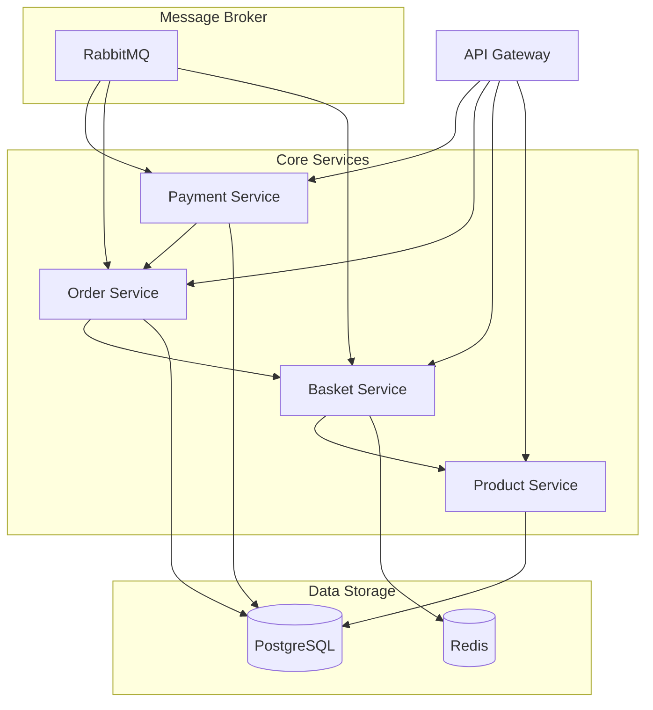
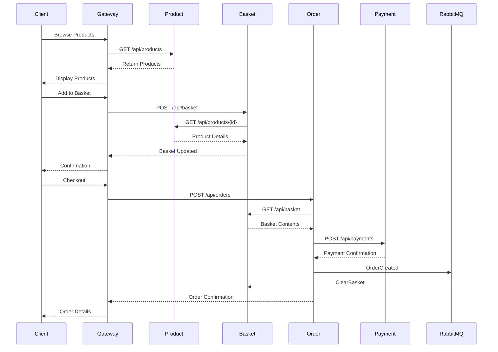

# Microservices E-Commerce Platform

A modern e-commerce platform built with microservices architecture using .NET 8, Docker, and various modern technologies.

## Architecture Overview

## System Flow

## Technologies Used

- **.NET 8**: Core framework for all microservices
- **Docker**: Containerization and orchestration
- **PostgreSQL**: Primary database for Product, Order, and Payment services
- **Redis**: In-memory cache for Basket service
- **RabbitMQ**: Message broker for async communication
- **YARP**: API Gateway implementation
- **MediatR**: CQRS pattern implementation
- **AutoMapper**: Object mapping
- **Swagger/OpenAPI**: API documentation

## Getting Started

1. Clone the repository
2. Ensure Docker and Docker Compose are installed
3. Run `docker-compose up -d`
4. Access services through the API Gateway at `http://localhost:5223`

## Service Ports

- API Gateway: 5223
- Product Service: 5043
- Basket Service: 5228
- Order Service: 5193
- Payment Service: 5173
- PostgreSQL: 5432
- Redis: 6379
- RabbitMQ: 5672 (AMQP), 15672 (Management UI)

## Development

Each microservice is independently deployable and follows the same basic structure:
- Application Layer: Business logic and use cases
- Infrastructure Layer: External services and persistence
- API Layer: Controllers and endpoints

## Contributing

1. Fork the repository
2. Create a feature branch
3. Commit your changes
4. Push to the branch
5. Create a Pull Request 